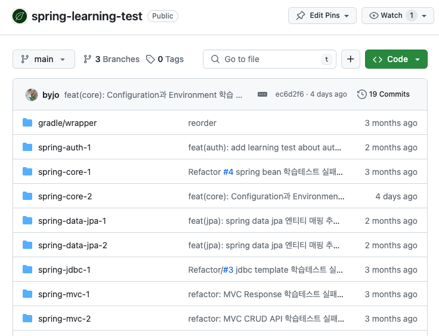
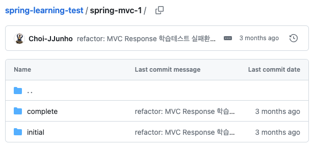
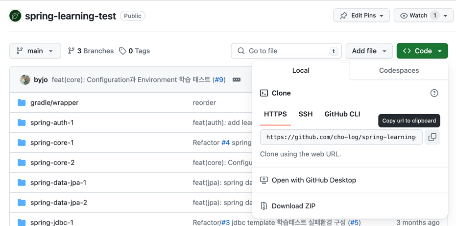
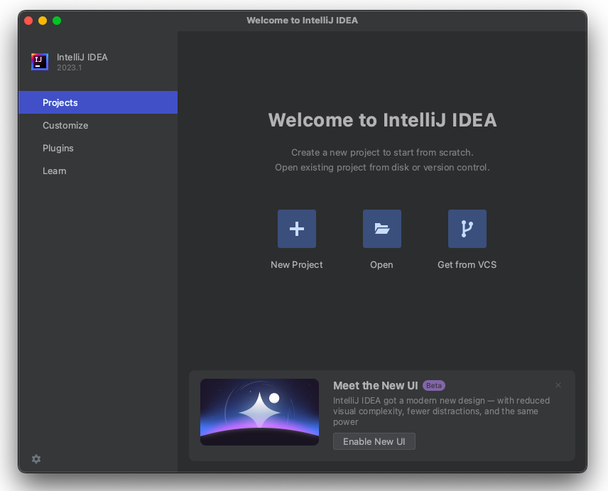
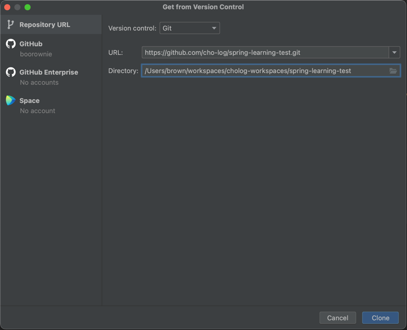
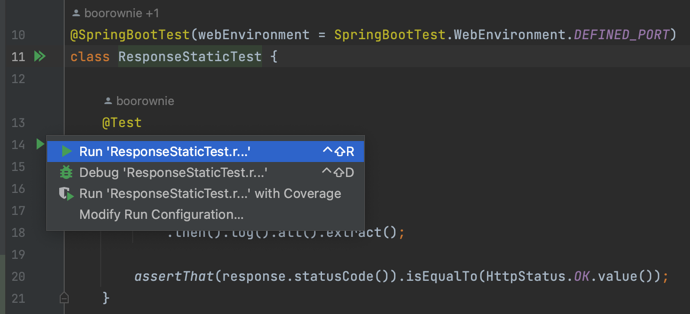
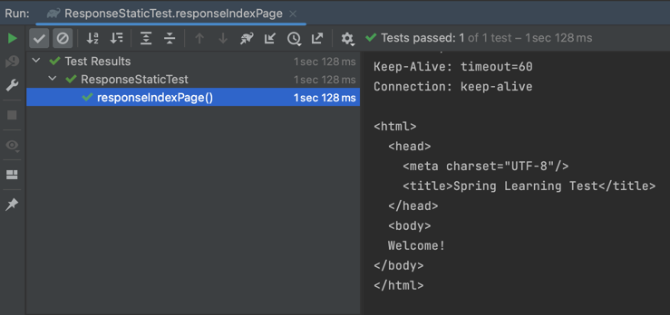
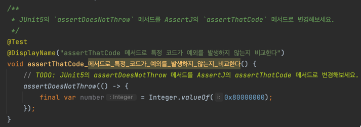

# 학습 테스트 소개

학습 테스트는 프로그래밍과 관련하여 새로운 프레임워크나 API를 배울 때 사용되는 용어입니다.
이는 개발자가 새로운 기술이나 라이브러리의 기능을 이해하고,
올바르게 작동하는지 검증하기 위해 작성하는 간단한 테스트 코드를 의미합니다.
학습 테스트는 주로 개발자가 해당 기술을 실제 프로젝트에 적용하기 전에 실험적으로 학습하는 데 도움을 줍니다.

---

## 순서
- [학습 테스트 구조 소개](#학습-테스트-구조-소개)
- [학습 테스트 실행시키기](#학습-테스트-실행시키기-(complete))
- [학습 테스트 성공시키기](#학습-테스트-성공시키기-(initial))
- [학습 테스트 직접 만들기](#학습-테스트-직접-만들기)

---

### 학습 테스트 구조 소개
학습 테스트는 주제별로 디렉토리가 나눠져 있습니다.

각 디렉토리에는 initial과 complete 디렉토리가 있습니다.

- complete: 이미 성공하는 학습 테스트를 실행시켜보기 위한 디렉토리
- initial: 실패하는 학습 테스트를 코드 작업을 통해 성공시켜보기 위한 디렉토리

---

### 학습 테스트 실행시키기 (complete)
학습 테스트 저장소에서 로컬로 클론을 받기위해 저장소를 확인합니다.

- [자바 학습 테스트 저장소](https://github.com/cho-log/java-learning-test)
- [스프링 학습 테스트 저장소](https://github.com/cho-log/spring-learning-test)

인텔리제이에서 `Get from VCS` 버튼을 누릅니다.

저장소 주소와 클론 받을 경로를 입력하고 클론을 받습니다.

문서를 보고 실행할 테스트를 complete 패키지 하위에서 찾아 실행합니다.

성공 결과를 확인 합니다.

---

### 학습 테스트 성공시키기 (initial)

initial 패키지는 실패하는 테스트 상태입니다.

주석에 작성된 수행 방법을 참고하여 수정하세요.

---

### 학습 테스트 직접 만들기

스터디 컨텐츠로 사용되는 학습 테스트는 자유롭게 내용 추가 및 수정 요청이 가능합니다.

PR 작성 후 요청 메시지를 남겨 주시면 코드 리뷰 후 반영됩니다.

- PR 예시
    - [cho-log/spring-learning-test#1](https://github.com/cho-log/spring-learning-test/pull/1)
    - [cho-log/spring-learning-test#5](https://github.com/cho-log/spring-learning-test/pull/5)